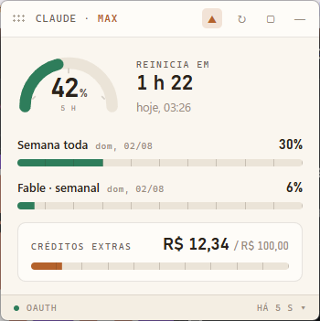
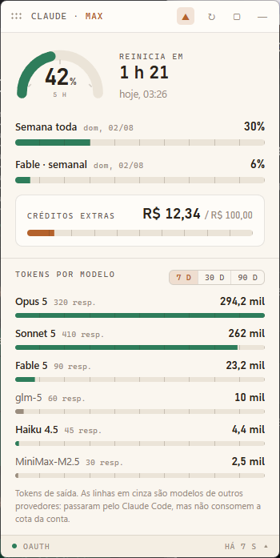

# claude-widget

Painel flutuante para Windows que mostra, sem abrir o navegador, quanto da sua
conta Claude Code já foi consumido: a sessão de 5 horas, a janela semanal, os
limites por modelo e os créditos extras. Abre também uma aba com os tokens
gastos por modelo nos últimos 7, 30 ou 90 dias.

<p align="center">
  
  
</p>

> As imagens acima usam dados de demonstração.

## Por que existe

Os limites que importam são invisíveis até estourarem. A sessão de 5 h reinicia
em horário móvel, a janela semanal reinicia em outro, e os créditos extras
correm por fora dos dois. Descobrir o estado exige abrir o navegador,
autenticar e ler uma página — atrito suficiente para ninguém fazer, o que leva
a bater no limite no meio de uma tarefa longa, sem aviso.

## De onde vêm os números

**Os percentuais** vêm do endpoint oficial de uso da Anthropic
(`GET api.anthropic.com/api/oauth/usage`), consultado com a credencial OAuth que
o próprio Claude Code já mantém em `%USERPROFILE%\.claude\.credentials.json`.
É o mesmo endpoint que o `/usage` do CLI usa. Refletem a **conta inteira**.

**Os tokens por modelo** vêm dos transcripts que o Claude Code grava em
`%USERPROFILE%\.claude\projects\**\*.jsonl`, onde cada resposta traz o modelo e
o `usage`. Refletem **apenas aquela máquina** — se você usa o Claude Code em
mais de um computador, cada widget mostra a sua parte.

Nada é estimado. Até a cor de alerta (verde, âmbar, vermelho) vem do campo
`severity` da própria API, em vez de um limiar inventado localmente.

## Instalação

Requisitos: Windows 10/11 64 bits, Node.js 22.12 ou mais novo, e o Claude Code
instalado e autenticado na máquina.

```powershell
git clone https://github.com/giovani-junior-dev/claude-widget.git
cd claude-widget

npm install        # a única dependência é o Electron
npm run preparar   # baixa o binário do Electron, ~100 MB, só na primeira vez
npm test           # 31 verificações
npm start
```

O passo `npm run preparar` não é opcional e o motivo não é óbvio: o Electron 43
**não** baixa o binário durante o `npm install`, ele espera o primeiro uso. Sem
esse passo, o `npm start` parece travado enquanto baixa 100 MB em silêncio. O
`npm run preparar` faz o mesmo download mostrando o progresso, e termina
imprimindo `v43.2.0`.

## Uso

| Onde | O quê |
|---|---|
| Barra de topo | Arrasta a janela |
| ▲ | Fixa sobre as outras janelas |
| ↻ | Atualiza agora |
| ▢ | Modo compacto |
| — | Recolhe para a bandeja |
| Rodapé | Abre e fecha a aba de tokens por modelo |
| Ícone da bandeja | Mostra e esconde; clique direito abre o menu |

Posição, modo compacto, período da aba e "sempre no topo" ficam guardados entre
uma abertura e outra.

### Abrir junto com o Windows

Pelo menu da bandeja, em **Iniciar com o Windows**, ou pelo terminal:

```powershell
npm run autostart:on
npm run autostart:off
npm run autostart:status
```

É um atalho na pasta Inicializar. Nada é escrito no registro, e apagar o atalho
à mão também desliga — o menu reflete o estado real do arquivo.

### Levar para outra máquina

```powershell
npm run empacotar   # gera claude-widget.zip, ~52 KB, só o código
```

## Privacidade

- A credencial é aberta **somente para leitura**. O widget nunca escreve nela,
  para não disputar o arquivo com o próprio Claude Code.
- O token fica no processo principal e **nunca chega à janela**: para lá vão
  apenas números e textos já prontos. O renderer roda com isolamento de contexto
  ligado, sem integração com Node, e não carrega nada além do HTML local.
- A única conexão de rede é com `api.anthropic.com`. Não há telemetria.
- Quando o token expira, o widget avisa e espera você abrir o Claude Code. Ele
  não tenta renovar sozinho.

## Comportamento em falhas

| Situação | O que acontece |
|---|---|
| Credencial expirada | Faixa âmbar pedindo para abrir o Claude Code; último valor em cinza, com a hora |
| Sem conexão | Continua tentando, dobrando o intervalo de 5 até 30 minutos |
| Resposta em formato inesperado | O campo vira travessão; o resto da tela continua funcionando |
| Campo ausente na resposta | Travessão, nunca `0%` |

O widget prefere mostrar um dado velho e avisado a inventar um novo.

## Desenvolvimento

```powershell
npm test                 # node:test, sem framework
npm run icons            # regenera os ícones da bandeja
```

Estrutura:

```
main.js             janela, bandeja, ciclo de atualização, IPC
preload.js          ponte mínima entre processo principal e janela
index.html          a interface
renderer.js         desenha os dados na tela
lib/creds.js        lê e valida a credencial local
lib/usage.js        a chamada HTTP
lib/view-model.js   converte a resposta no que a tela mostra (função pura)
lib/token-usage.js  tokens por modelo, com índice incremental
lib/window-state.js posição e preferências, validadas contra os monitores
lib/poll-policy.js  intervalo entre consultas e recuo em caso de falha
lib/autostart.js    o atalho da pasta Inicializar
tools/              ícones, empacotamento, início automático por CLI
test/               fixtures com a estrutura real da API e as verificações
```

A leitura dos transcripts usa um índice incremental: como esses arquivos só
crescem no fim, cada consulta reprocessa apenas o trecho novo. Na prática, a
primeira varredura de 7 dias leva cerca de 2 s e as seguintes, incluindo trocar
o período, ficam em torno de 40 ms.

## Limitações conhecidas

- **Só Windows.** O código do widget é portável, mas o início automático usa
  atalho da pasta Inicializar, que é específico do Windows.
- **Tokens não viram percentual de limite.** A Anthropic não expõe a fórmula que
  converte uso em cota, então a aba informa consumo, não prevê quando você bate
  no teto.
- **A aba de tokens é por máquina**, não por conta.
- **Não é oficial** e não tem vínculo com a Anthropic. Usa o mesmo endpoint que
  o Claude Code usa, com a credencial que ele já guarda localmente.

## Licença

MIT — veja [LICENSE](LICENSE).
